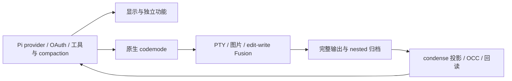

# 架构与所有权

根 `package.json` 统一依赖、版本、入口和发布载荷；加载 `extensions/*.ts` 与 `themes/metis-pi.json`。运行实现直接使用 TS。

## 入口和模块

| 入口 | 所有者与职责 |
| --- | --- |
| `appearance.ts` | `src/extension.ts` 装配显示、宿主适配、转录、chrome、复制和诊断。 |
| `skill-mux.ts` / `skill-entry.ts` | Pi 持有 skill 来源和优先级；metis 负责多输入展开、补全、标签和折叠。 |
| `goal.ts` | 入口负责宿主 I/O、提示和工具；`src/goal-state.ts` 负责状态、计时、分支恢复和用量。 |
| `dynamic-agents.ts` | 每个 run 的全局指令快照、来源恢复与 Pi 原生请求投影。 |
| `condense.ts` | 重复安装检测和摘要用量显示；`src/condense` 负责原文、精简、摘要、恢复和 OCC。 |
| `action-fusion.ts` | Pi edit/write 的 then_run 增强；`src/execution/action-fusion.ts` 负责路径排队、快照、取消和回执。 |
| `execution.ts` | deferred 进程/图片工具、执行设置、后台 shell 和资源清理。 |
| `mcp.ts` | 默认关闭；`src/mcp` 持有目录缓存、连接租约和工具装配，协议/OAuth/CLI/codemode/权限由 Pi 提供。 |

`metis-pi.json.enabled` 只控制 appearance，独立入口由 Pi 包过滤控制，见 [配置](configuration.md)。

## 显示数据流

宿主事件 → 状态/度量 → 快照 → 组件；宿主 updateContent → AssistantView → 阶段策略 → 子树装饰。

| 领域 | 主要模块和边界 |
| --- | --- |
| 适配 | `host-data.ts` 归一化公开数据；`adapter.ts` 校验工具来源和 renderer 所有权，每次行渲染共用一次工具查询；`config.ts` 校验显示设置。 |
| 工具输出与修改 | `renderers.ts` 装配，`shell.ts` / `diff.ts` / `write-preview.ts` 布局；`write-tracker.ts` 保存真实前后镜像，与 Fusion 共用路径规则。 |
| 转录与思考 | `transcript-state.ts` 持有消息身份、语义 run 和计时；仅用已观察的响应身份恢复计时，内容相同不合并，身份冲突不推断时长；AssistantView 解析一次，`thinking-view.ts` 持有交互形态。原生 codemode 的 nested 工具事件不参与顶层探索分组。 |
| chrome | `chrome/install.ts` 捕获宿主；editor/header/footer/working 各自持有组件；`fullscreen-layout.ts` 统一留白和 history-window，只安装一个布局根拦截器。 |
| 度量与摘要 | metrics/outcome/usage/speed 模块分别采样与去重；`git-changes.ts` 只读 Git；`turn-summary.ts` 是显示层唯一追加会话记录的模块。 |
| 复制与呈现 | `selection-copy/` 读取当前已提交帧的来源映射，不额外渲染；缓存校验原生渲染行，未知区域原生回退。渲染映射和计数随进程保留，选区序列化按真实 TUI 租用并释放，支持宿主代理切换接收者。颜色/控制序列在显示层处理，glyph 转换在布局之后。 |

chrome 通过结构类型和注入能力访问宿主。动画帧不扫描会话、读磁盘或查询额度。显示适配保留原执行、结果和模型正文。
宿主事件类型及终端字符宽度、grapheme 截断复用 Pi 的公开接口。

## 执行与上下文

Pi 持有工具选择、权限、JS 编排和普通上下文管理。metis 仅保留进程/图片补充及图片 detail 的窄请求适配，不维护第二套 provider 或 JS 引擎。图片描述使用 Pi ModelRegistry，original 保存到 session blobs。

显式启用 MCP 后，每个服务器由一个 session owner 共享连接；每个工具独立注册，调用经过 Pi 原执行链。目录缓存不授权执行，实时 schema/身份变化会拒绝旧调用；空闲回收、取消和关闭属于该 owner。MCP 协议与 OAuth 复用 Pi 公共包；服务器配置、凭据及 CLI 保持原生格式。切换步骤见 [配置](configuration.md#mcp)。

condense 分开持有原文、候选和已发布表示；父子引用、保护、错误和归档失败参与发布门禁。OCC 由 condense 在 `session_before_compact` 准备，执行模块只提供忙状态，goal 暂存续跑并在完成后复核；没有第二个 compaction owner。

## 生命周期与交付

- 会话切换先失效化旧 generation，再恢复 UI、释放资源、绑定新上下文；晚到结果不得重新安装旧组件。
- 组件租约仅恢复自己仍拥有的方法；部分安装失败和重复关闭也清理。
- GoalState 读取不累计时间，用量归属于启动该回合的目标，持久化为 session custom entry v2。
- 原文 blobs、Fusion 日志与显示缓冲寿命不同；显示淘汰不授权删除恢复证据。锁、取消和提交顺序由各功能 owner 持有。

`native/tools` 保存 PTY/图片源码与锁文件，`assets/native-tools` 保存随包可执行资产；shell parser WASM 位于 `vendor/tree-sitter-bash`。安装不编译 Rust，发布包不携带 native 开发源码。来源见 [执行模块来源](provenance/execution/README.md)与 condense 自身目录；交付流程见 [开发说明](development.md)。
