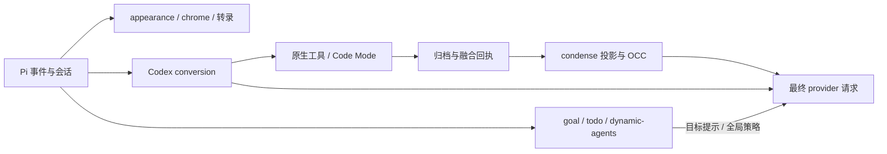

# 架构与模块职责

本页描述当前所有权和调用关系。功能用法从 [文档导航](README.md) 进入，构建/验证流程见 [开发说明](development.md)，宿主适配条件见 [兼容性](compatibility.md)。

## 扩展入口

`package.json` 加载 `extensions/*.ts` 和 `vendor/pi-codex-conversion/dist/index.js`；主题单独位于 `themes/metis-pi.json`。

| 入口 | 负责内容 |
| --- | --- |
| `appearance.ts` → `src/extension.ts` | 显示装配、宿主能力、转录、chrome、复制和诊断。 |
| `skill-mux.ts` / `skill-entry.ts` | skill 正文展开与发现、标签和折叠；补全接线使用 composer。 |
| `todo.ts` → `src/todo/` | 工具/命令、持久化列表、任务面板及会话交接。 |
| `goal.ts` → `src/goal-state.ts` | 入口处理宿主 I/O、提示和工具；状态核心处理目标、计时、分支恢复和回合用量。 |
| `dynamic-agents.ts` → `src/dynamic-agents.ts` | 每次 run 的全局策略快照、来源恢复和请求投影；conversion 通过事件总线共享结果。 |
| `condense.ts` → `vendor/pi-condense/index.ts` | 重复安装检测、单一加载入口和摘要用量展示；vendor 负责归档、精简/摘要和恢复。 |
| `action-fusion.ts` | 融合修改/命令的统一开关、原生 edit/write 适配、修改快照和取消。 |
| conversion `dist/index.js` | 转导出 `src/index.ts`，由 `src/extension/register.ts` 接线：provider、执行工具、上下文与设置。 |

`metis-pi.json.enabled` 控制 appearance。其他入口的配置与禁用方法见 [配置参考](configuration.md)。

## 显示与宿主数据

| 领域 | 所有者与边界 |
| --- | --- |
| 装配与适配 | `src/extension.ts` 装配；`host-data.ts` 归一化公开数据；`adapter.ts` 校验工具来源和 renderer 所有权；`config.ts` 校验显示配置。 |
| 工具显示 | `renderers.ts` 装配 call/result；`tool-names.ts` 提供类型和路径语言映射，diff component 不反向依赖装配层；`shell.ts` 按物理行预算，`diff.ts` / `diff-component.ts` 共享 diff，`explore.ts` 管探索显示。 |
| 写入快照 | `write-tracker.ts` 捕获真实 pre/post image，`write-preview.ts` 展示；`apply-patch-view.ts` 读取转换层的执行前快照。`native-tool-path.ts` 与 Action Fusion 共用路径规则。 |
| 转录与思考 | `transcript-state.ts` 持有稳定消息身份、语义 run、计时和控制器；一次解析的 AssistantView 供阶段策略和装饰共享，交互形态由 `thinking-view.ts` 处理。 |
| chrome | `chrome/install.ts` 捕获宿主；editor/header/footer/working 各自拥有组件。`fullscreen-layout.ts` 统一协调留白与 history-window，只有一个布局根拦截器。 |
| 度量与摘要 | `ui-metrics.ts` 计时，`interaction-outcome.ts` 判断终止证据，`usage-ledger.ts` 去重，`output-speed.ts` 采样，`git-changes.ts` 只读采样工作树。`turn-summary.ts` 是显示层唯一追加会话记录的模块。 |
| 复制与文字 | `selection-copy/` 把文本 span 绑定到已提交渲染数组；adapter 补齐 self-shell 外层关系。`palette.ts` / `sgr.ts` 处理颜色能力/控制序列，`surface.ts` / `output-style.ts` 决定呈现策略，glyph presenter 在布局后处理显示字形。 |

数据流是“宿主事件 → 状态/度量 → 快照 → 显示组件”和“宿主 updateContent → AssistantView → 阶段策略 → 子树装饰”。复制读取当前已提交帧的来源映射，无法验证的区域使用原生提取；不为复制再渲染一次。

chrome 使用结构类型和注入能力，不直接导入宿主包。动画帧不扫描会话、不读磁盘或查询额度。显示适配保留原执行与结果；独立功能的工具注册和上下文投影由各自入口负责。

## 执行、请求和压缩

| 领域 | 所有者与不可合并的责任 |
| --- | --- |
| 模式与设置 | conversion `adapter/activation/runtime-plan.ts` 决定模式；字段规范化、信任范围、原子写入与设置 UI 各守自己的边界。 |
| provider 请求 | `prepareResponsesTranscript` 统一 transcript/system/工具放置；transcript 与 sampling 复用宿主 helper，保留本地切片和旧会话包装；`adapter/provider-request.ts` 共享 live/prewarm 准备，最终请求才消费待处理窗口和捕获 prompt。工具调用/结果配对由 `normalizeResponsesToolHistory` 负责。 |
| compaction/replay | 切片沿用完整历史的工具决策；压缩 input 和顶层 tools 同步更新，canonical 请求保留基线。Local/Tree/Remote/Hybrid 的持久化、窗口和 wire 差异分别保留。 |
| history/notes | `context-management/tool-contract.ts` 共享字段规则；`adapter/history-insertion.ts` 只负责稳定插入，筛选仍由调用方决定。 |
| V8 Code Mode | `host-client.ts` 独占 framed connection、session/open 协议和 delegate 回应；安装和持久化路径使用跨进程 lease。 |
| Action Fusion | vendor `tools/action-fusion.ts` 共享流程和按路径排队，command adapter 分别连接原生 bash 与 exec manager；`src/fusion-view.ts` 只组合修改和命令显示。嵌套 delegate 的 journal 独立于显示 trace。 |
| condense 批次 | 同一批次记录持有去重、准备和摘要结果，调度与提交共同消费；原文、候选和已发布表示分开，失败恢复顺序保持。`spill.ts` 统一归档/backfill，调用方决定何时允许隐藏。 |
| condense 设置/恢复 | `setting-fields.ts` 持有字段规则；overlay 和命令保留各自非法值策略。session_start/tree 共用分支恢复，配置加载和启动提示只在 start 执行。 |
| OCC | condense 持有等待、工作计数、保持期和尝试额度；conversion 独占 before_compact，通过 promise broker 等候受保护候选。goal 暂存已有续跑，维护后执行时再次核实；归档准备与发布授权分开。 |

OCC 使用宿主 `context_edit` 后的有效投影，frontier 仍使用原始 assistant 来源序号。condense、预热和正式请求共享完成后的投影；flush 期间跳过预热。具体压缩、归档和后端限制集中在 [condense](features/condense.md)。

## 生命周期与持久化

- 会话切换先失效化旧 generation，再恢复旧 UI、释放资源和绑定新上下文；晚到结果不得重新安装旧组件或复活旧 kernel。
- 原型/组件租约只恢复自己仍拥有的方法，保留第三方后来安装的包装。部分安装失败和重复关闭也走清理路径。
- todo model 验证领域规则并生成任务行；store 拥有锁和磁盘；tools 解析路径/通知；widget 持有显示状态，入口负责 UI 与 store 的会话交接。
- GoalState 的读取不累计时间；状态切换与回合结算记账，用量归属于启动该回合的目标，持久化使用 session custom entry v2。
- 原文 blobs、融合 journal 与显示缓冲寿命不同；显示淘汰不授权删除恢复证据。锁、提交顺序、取消与部分失败结果保留在各执行 owner 中。

## 源码与生成物

源码和 Git 历史保存本地实现；vendor `UPSTREAM.md` / `PATCHES.md` 说明来源和差异。运行实现直接采用 TS；`dist/` 仅保留旧入口和公开 API 的转导出，开发检查不生成 JS/声明。本地资产及相对位置继续保留；累计 patch 和覆盖式同步已退休。

旧入口路径仍参与工具来源认领，部分共享状态 key 包含模块 URL，资源也依赖相对路径。公开 facade、原生 ABI 和惰性加载不能仅凭静态导入图判断为可删代码。实际验证范围见 [VALIDATION](../VALIDATION.md)。
