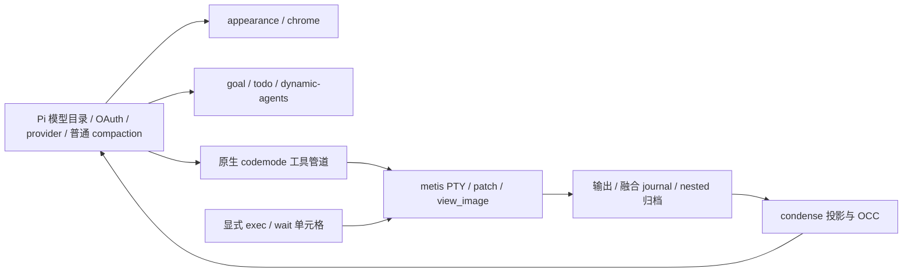

# 架构与模块职责

本页描述当前所有权和调用关系。功能用法从 [文档导航](README.md) 进入，构建/验证流程见 [开发说明](development.md)，宿主适配条件见 [兼容性](compatibility.md)。

## 扩展入口

`package.json` 加载 `extensions/*.ts`；主题单独位于 `themes/metis-pi.json`。

| 入口 | 负责内容 |
| --- | --- |
| `appearance.ts` → `src/extension.ts` | 显示装配、宿主能力、转录、chrome、复制和诊断。 |
| `skill-mux.ts` / `skill-entry.ts` | skill 正文展开与发现、标签和折叠；补全接线使用 composer。 |
| `todo.ts` → `src/todo/` | 工具/命令、持久化列表、任务面板及会话交接。 |
| `goal.ts` → `src/goal-state.ts` | 入口处理宿主 I/O、提示和工具；状态核心处理目标、计时、分支恢复和回合用量。 |
| `dynamic-agents.ts` → `src/dynamic-agents.ts` | 每次 run 的全局策略快照、来源恢复和请求投影；使用 Pi 原生请求投影。 |
| `condense.ts` → `vendor/pi-condense/index.ts` | 重复安装检测、单一加载入口和摘要用量展示；vendor 负责归档、精简/摘要和恢复。 |
| `action-fusion.ts` | 融合修改/命令的统一开关、原生 edit/write 适配、修改快照和取消。 |
| `execution.ts` | PTY/patch/view_image、独立 V8、窄执行设置和后台 shell 生命周期。 |

`metis-pi.json.enabled` 控制 appearance。其他入口的配置与禁用方法见 [配置参考](configuration.md)。

## 显示与宿主数据

| 领域 | 所有者与边界 |
| --- | --- |
| 装配与适配 | `src/extension.ts` 装配；`host-data.ts` 归一化公开数据；`adapter.ts` 校验工具来源和 renderer 所有权；`config.ts` 校验显示配置。 |
| 工具显示 | `renderers.ts` 装配 call/result；`tool-names.ts` 提供类型和路径语言映射，diff component 不反向依赖装配层；`shell.ts` 按物理行预算，`diff.ts` / `diff-component.ts` 共享 diff，`explore.ts` 管探索显示。 |
| 写入快照 | `write-tracker.ts` 捕获真实 pre/post image，`write-preview.ts` 展示；`apply-patch-view.ts` 读取执行模块的执行前快照。`native-tool-path.ts` 与 Action Fusion 共用路径规则。 |
| 转录与思考 | `transcript-state.ts` 持有稳定消息身份、语义 run、计时和控制器；一次解析的 AssistantView 供阶段策略和装饰共享，交互形态由 `thinking-view.ts` 处理。 |
| chrome | `chrome/install.ts` 捕获宿主；editor/header/footer/working 各自拥有组件。`fullscreen-layout.ts` 统一协调留白与 history-window，只有一个布局根拦截器。 |
| 度量与摘要 | `ui-metrics.ts` 计时，`interaction-outcome.ts` 判断终止证据，`usage-ledger.ts` 去重，`output-speed.ts` 采样，`git-changes.ts` 只读采样工作树。`turn-summary.ts` 是显示层唯一追加会话记录的模块。 |
| 复制与文字 | `selection-copy/` 把文本 span 绑定到已提交渲染数组；adapter 补齐 self-shell 外层关系。`palette.ts` / `sgr.ts` 处理颜色能力/控制序列，`surface.ts` / `output-style.ts` 决定呈现策略，glyph presenter 在布局后处理显示字形。 |

数据流是“宿主事件 → 状态/度量 → 快照 → 显示组件”和“宿主 updateContent → AssistantView → 阶段策略 → 子树装饰”。复制读取当前已提交帧的来源映射，无法验证的区域使用原生提取；不为复制再渲染一次。

chrome 使用结构类型和注入能力，不直接导入宿主包。动画帧不扫描会话、不读磁盘或查询额度。显示适配保留原执行与结果；独立功能的工具注册和上下文投影由各自入口负责。

## 执行、请求和压缩

| 领域 | 所有者与边界 |
| --- | --- |
| 执行配置 | `src/execution/config.ts`；全局 → 受信任项目，合并 `metis-pi.json.execution`，读取不写文件。工具选择由 Pi 持有。 |
| provider / 上下文 | Pi 原生实现；metis 不注册 provider、不重写通用请求/header、不维护特殊窗口、checkpoint 或 transport。图片 detail 是单独的窄请求适配。 |
| V8 Code Mode | `src/code-mode/host-client.ts` 独占 framed connection 与协议；cell 固定初始执行上下文，观察者单独路由更新；插话只提前结束观察，cell 可继续运行。native callable 工具没有被裸执行，原生 codemode 负责通用编排。 |
| Action Fusion | `src/execution/action-fusion.ts` 共享流程与路径排队，command adapter 分别连接 Pi bash 和 exec manager；`src/fusion-view.ts` 组合显示。journal 独立于显示 trace。 |
| 图片 | `view-image/tool.ts` 使用 Pi 模型注册表描述图片；`hints.ts` 按 call/ordinal 关联 final Responses 图片，original 字节保存在现有 session blobs。 |
| condense | 原文、候选和已发布表示分开；nested child 用现有 indexer/spill 归档。父子引用、保护、错误和归档失败守卫保留在精简及 OCC 路径。 |
| OCC | condense 直接处理 `session_before_compact`，持有工作计数、经济等待和尝试额度；goal 暂存续跑并在完成后复核。执行模块仅提供忙状态；没有第二个 compaction owner。 |

OCC 使用宿主 `context_edit` 后的有效投影，frontier 使用原始 assistant 来源序号。恢复、取消和发布规则见 [condense](features/condense.md)。

## 生命周期与持久化

- 会话切换先失效化旧 generation，再恢复旧 UI、释放资源和绑定新上下文；晚到结果不得重新安装旧组件。
- 原型/组件租约只恢复自己仍拥有的方法，保留第三方后来安装的包装。部分安装失败和重复关闭也走清理路径。
- todo model 验证领域规则并生成任务行；store 拥有锁和磁盘；tools 解析路径/通知；widget 持有显示状态，入口负责 UI 与 store 的会话交接。
- GoalState 的读取不累计时间；状态切换与回合结算记账，用量归属于启动该回合的目标，持久化使用 session custom entry v2。
- 原文 blobs、融合 journal 与显示缓冲寿命不同；显示淘汰不授权删除恢复证据。锁、提交顺序、取消与部分失败结果保留在各执行 owner 中。

## 源码与生成物

metis-pi 是一个 npm 产品，根 manifest 统一依赖、版本、入口和发布载荷。生产实现直接运行 TS，测试与显示层使用同一模块 URL。

| 位置 | 归属 |
| --- | --- |
| `src/execution`、`src/code-mode` | 保留的本地执行领域、V8 和生命周期接线。 |
| `vendor/tree-sitter-bash` | shell parser 的固定 WASM 来源。 |
| `native/code-mode-host`、`native/tools` | 独立 Cargo workspace；源码和锁文件在 Git，安装不编译。 |
| `assets/native-tools` | 随包执行文件，以绝对路径定位，保留可执行位。 |
| `docs/provenance/codex-conversion` | 保留模块的许可、来源和历史差异。 |
| `vendor/pi-condense` | 独立来源树与单行入口。 |

V8 host 依次查找随包 host、开发构建、按 release 区分的缓存。host pin、缓存键和协议未因 Pi 交接改变。发布包不带 Rust 源码/构建产物，但保留许可证与 NOTICE。实际验证范围见 [VALIDATION](../VALIDATION.md)。
